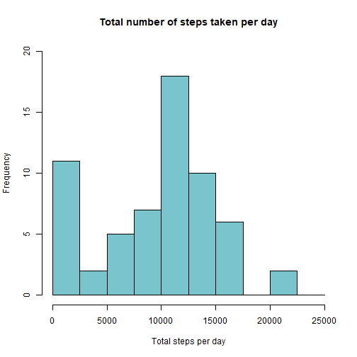
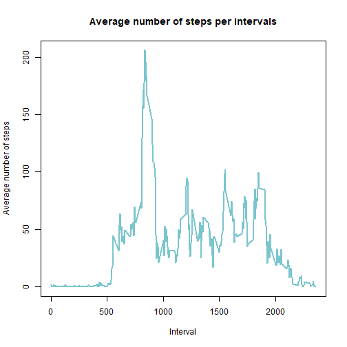
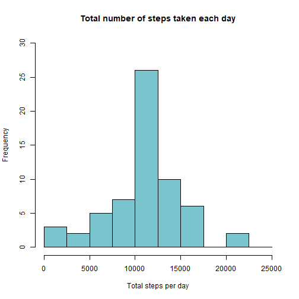
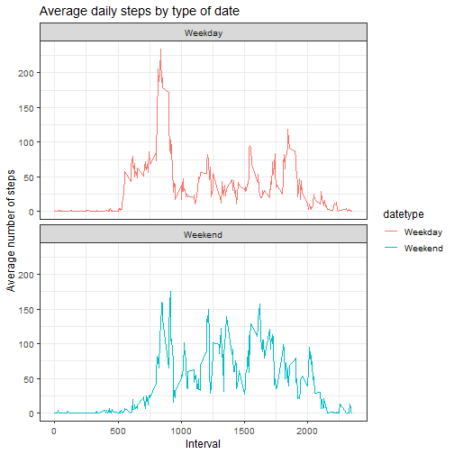

### Loading and preprocessing the data
At this stage, the data was downloaded, stored, and loaded for continuation of analysis.

```r
library(ggplot2)

setwd ("C:/Users/troko/Downloads/Reproducible_Research_project1")
activity <- read.csv("activity.csv")
activity_pd <- data.frame(activity)
summary(activity_pd)
```

```
##      steps            date              interval     
##  Min.   :  0.00   Length:17568       Min.   :   0.0  
##  1st Qu.:  0.00   Class :character   1st Qu.: 588.8  
##  Median :  0.00   Mode  :character   Median :1177.5  
##  Mean   : 37.38                      Mean   :1177.5  
##  3rd Qu.: 12.00                      3rd Qu.:1766.2  
##  Max.   :806.00                      Max.   :2355.0  
##  NA's   :2304
```

### What is mean total number of steps taken per day?

```r
total_steps <- with(activity_pd, aggregate(steps, by = list(date), FUN = sum, na.rm = TRUE))
names(total_steps) <- c("date", "steps")
hist(total_steps$steps, main = "Total number of steps taken per day", xlab = "Total steps per day", col = "cadetblue3", ylim = c(0,20), breaks = seq(0,25000, by=2500))
```



```r
mean(total_steps$steps)
```

```
## [1] 9354.23
```

```r
median(total_steps$steps)
```

```
## [1] 10395
```

### What is the average daily activity pattern?

```r
average_daily_activity <- aggregate(activity_pd$steps, by=list(activity_pd$interval), FUN=mean, na.rm=TRUE)
names(average_daily_activity) <- c("interval", "mean")
plot(average_daily_activity$interval, average_daily_activity$mean, type = "l", col="cadetblue3", lwd = 2, xlab="Interval", ylab="Average number of steps", main="Average number of steps per intervals")
```



```r
average_daily_activity[which.max(average_daily_activity$mean), ]$interval
```

```
## [1] 835
```

### Imputing missing values

```r
sum(is.na(activity_pd$steps))
```

```
## [1] 2304
```

```r
imputed_missing_steps <- average_daily_activity$mean[match(activity_pd$interval, average_daily_activity$interval)]
activity_imputed <- transform(activity_pd, steps = ifelse(is.na(activity_pd$steps), yes = imputed_missing_steps, no = activity_pd$steps))
total_steps_imputed <- aggregate(steps ~ date, activity_imputed, sum)
names(total_steps_imputed) <- c("date", "daily_steps")

hist(total_steps_imputed$daily_steps, col = "cadetblue3", xlab = "Total steps per day", ylim = c(0,30), main = "Total number of steps taken each day", breaks = seq(0,25000,by=2500))
```



```r
mean(total_steps_imputed$daily_steps)
```

```
## [1] 10766.19
```

```r
median(total_steps_imputed$daily_steps)
```

```
## [1] 10766.19
```

### Are there differences in activity patterns between weekdays and weekends?

```r
activity_pd$date <- as.Date(strptime(activity_pd$date, format="%Y-%m-%d"))
activity_pd$datetype <- sapply(activity_pd$date, function(x) {
        if (weekdays(x) == "Saturday" | weekdays(x) =="Sunday") 
                {y <- "Weekend"} else 
                {y <- "Weekday"}
                y
        })


activity_by_date <- aggregate(steps~interval + datetype, activity_pd, mean, na.rm = TRUE)
plot<- ggplot(activity_by_date, aes(x = interval , y = steps, color = datetype)) +
       geom_line() +
       labs(title = "Average daily steps by type of date", x = "Interval", y = "Average number of steps") +
       facet_wrap(~datetype, ncol = 1, nrow=2) +
       theme_bw(12)
print(plot)
```


